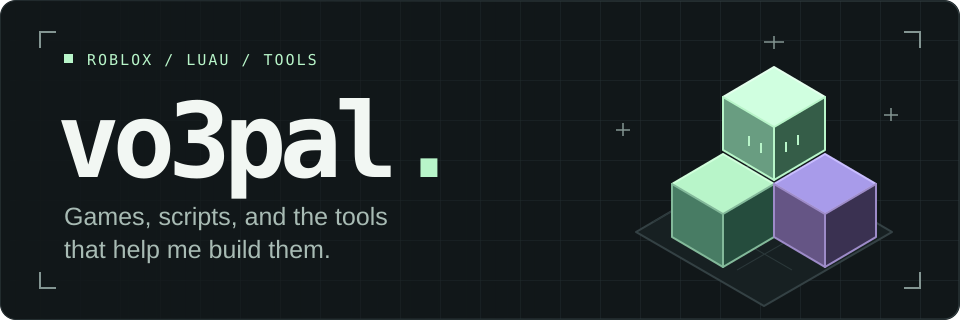

  <picture>
    <source media="(max-width: 600px)" srcset="./assets/header-mobile.svg" />
    
  </picture>

I build game systems and tools for **Roblox Studio**. Most of my work is in **Luau**; lately I've been using **TypeScript** to build AI agents that can work inside the editor.

[Portfolio ↗](https://sites.google.com/view/vo3pal/project-page) &nbsp; / &nbsp; [YouTube ↗](https://www.youtube.com/@Vo3palScripter) &nbsp; / &nbsp; [Repositories ↗](https://github.com/vo3pal?tab=repositories)

## On my workbench

### [01 / Obscura ↗](https://github.com/vo3pal/obscura)

A Luau obfuscation engine written in Python. A research project in source transformation and bytecode virtualization, including a custom register-based VM.

`Python` &nbsp; `Luau` &nbsp; `Compiler design`

### [02 / XML Agent Foundation ↗](https://github.com/vo3pal/xml-agent-foundation)

The foundation for my agent tooling: a TypeScript loop that parses XML tool calls, runs tools, and feeds results back to the model. Built on the OpenRouter SDK.

`TypeScript` &nbsp; `Node.js` &nbsp; `Tool calling`

---

**Working with** &nbsp; Roblox Studio · Luau · TypeScript · JavaScript · Node.js · Python · Git

I'm open to collaborating on Roblox projects and developer tools.

  

